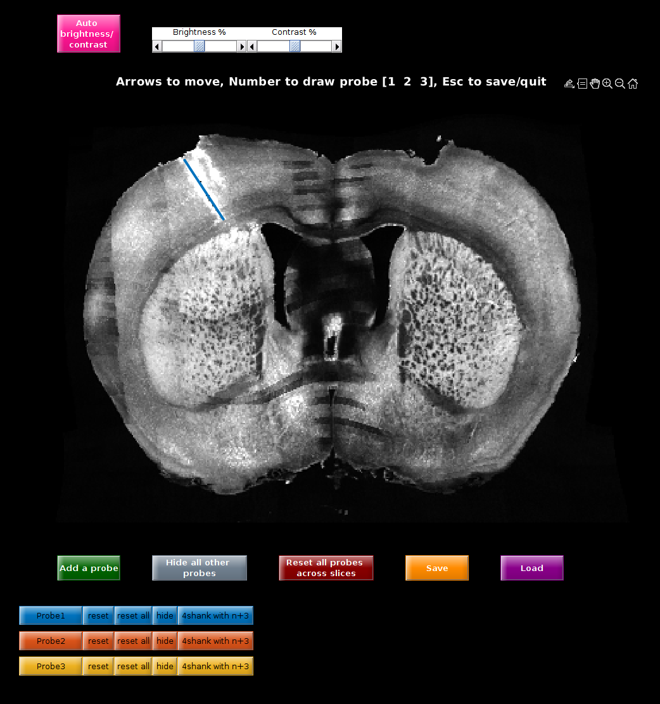

# braindraw

Tools to register histology images to an atlas using [brainreg](https://github.com/brainglobe/brainreg), manually refine the registration, and draw probes.

See `bd_histologyMain` to get started.

Based on [AP_histology](https://github.com/petersaj/AP_histology) and [allenCCF](https://github.com/cortex-lab/allenCCF).

#### Step 1: register your histology using brain reg

#### Step 2: Correct any orientation issues

#### Step 3: Draw probes

#### Step 4: Assign probes to ephys days/sites

#### Step 5: Align probes and ephys

