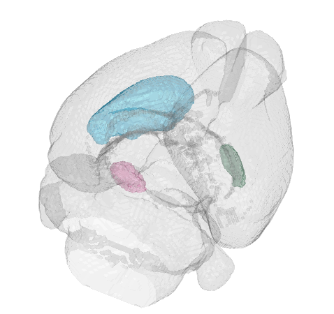

# 🚢 YAHT: Yet Another Histology Tool

 YAHT: Yet Another Histology Tool. The goal of this toolbox is to have an all-in-one pipeline to quickly go from histology to highly accurately-tracked probes.

YAHT allows for:
- preprocessing of histology images to get higher quality data,
- automated histology slice registration to a common atlas (using [brainreg](https://github.com/brainglobe/brainreg)),
- manual fine-tuning of the registration to get perfect fits,
- manual drawing of probes in an intuitive and easy to adjust way, using adjustable bezier curves,
- probe to ephys data alignement, and
- generation of high quality 3D probe location summary plots and videos. 

Largely based on [AP_histology](https://github.com/petersaj/AP_histology) and [allenCCF](https://github.com/cortex-lab/allenCCF).

### ⚒️ Installation

YAHT requires: 
- brainreg to be installed locally (use `pip install brainreg` in your favorite python environment)
- the files located [here](https://osf.io/fv7ed/#!) to be downloaded locally

Dependencies to install: 
- [npy-matlab](https://github.com/kwikteam/npy-matlab)

Other dependencies already integrated in YAHT (no need to download them):
- [allenCCF](https://github.com/cortex-lab/allenCCF)
- [Multipage TIFF stack](https://uk.mathworks.com/matlabcentral/fileexchange/35684-multipage-tiff-stack)

### 🏁 Quick start 

Adjust the paths in `ya_histologyMain_template` an run through the sections to get started. So far, this pipeline has not been widely used and tested. You will likely run into some issues and incompatibilities. Please contact me at julie[dot]mfabre[at]gmail[dot]com if that's the case. I'm happy to help! 

### 🔗 Pipeline steps
- Step 0: preprocessing

Optionally, despeckle and remove outliers from your data to improve the fit to the common atlas. 

- Step 1: register your histology using brain reg

- Step 2: Correct any orientation issues

- Step 3: Fine tune the stretch factors on a slice-by-slice basis 

- Step 4: Draw probes

- Step 5: Assign probes to ephys days/sites

- Step 6: Align probes and ephys

- Step 7: Generate some beautiful plots and videos 

